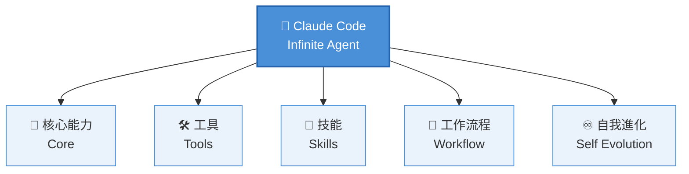

# 🤖 Claude Code — Infinite Agent OS

> 把 Claude Code 擬人化為一位「可持續進化、多形態變身、調用各種專業工具」的 AI 超級代理，並將其架構化為一套完整的 **AI Agent Operating System**。

---

## 📐 系統總覽

五個一級模組彼此互相支援：**核心能力**提供智能基礎，**工具**與**技能**是可插拔的能力配件，**工作流程**負責串接執行順序，**自我進化**則讓整個系統隨時間變強。

---

## 🗂 文件導覽

| 文件 | 內容 |
|---|---|
| [`docs/CORE.md`](docs/CORE.md) | 無限核心能力（Infinite Core）— 8 項基礎智能 |
| [`docs/MODULES.md`](docs/MODULES.md) | 專業配件（Professional Modules）— 8 大套件、40+ 工具 |
| [`docs/SKILLS.md`](docs/SKILLS.md) | 無敵技能樹（Ultimate Skills）— 6 大技能領域 |
| [`docs/MODES.md`](docs/MODES.md) | 四種變身模式（Transformation Modes） |
| [`docs/EVOLUTION.md`](docs/EVOLUTION.md) | 七級進化階梯 + CSE Meta Framework 七層對應 |
| [`docs/ROADMAP.md`](docs/ROADMAP.md) | 建議擴充模組（Roadmap / Next Modules） |

---

## 🧬 CSE Meta Framework 對應（七層架構速覽）

| 層級 | 模組 | 代表能力 |
|---|---|---|
| L1 | Core Intelligence | 推理、規劃、記憶、自我反思 |
| L2 | Skills | Prompt、Coding、Data、Business |
| L3 | Tools | GitHub、Docker、Playwright、Obsidian、Vercel 等 |
| L4 | Connectors | MCP、CLI、API、Webhook、資料庫 |
| L5 | Workflow | 任務拆解、自動化、Multi-Agent 協作 |
| L6 | Governance | 權限、審計、安全、版本控制 |
| L7 | Self-Evolution | 學習、優化、評估、能力升級 |

詳細說明見 [`docs/EVOLUTION.md`](docs/EVOLUTION.md)。

---

## 🚀 快速開始（作為知識庫使用）

1. Clone 本 repo，或直接在 GitHub 上瀏覽 `docs/` 底下各檔案（皆為純 Markdown，含 Mermaid 圖表，GitHub 原生渲染）。
2. 若要接入你的 **IPPOO 框架**（Input–Process–Pipeline–Output–Obsidian），可將本 repo 作為 Obsidian Vault 的一個子模組，讓 Claude / Claude Code / GPT 共用同一份架構定義作為交接文件的錨點。
3. 若要用於課程教材（資策會 / 工研院 AI 課），建議搭配 `docs/EVOLUTION.md` 的七層架構圖，作為「AI Agent 能力地圖」的教學骨架。

---

## 📌 版本說明

本文件為 **living document**，隨 Claude Code 新增工具 / MCP 生態擴張持續更新。歡迎透過 PR 或 Issue 擴充「專業配件」與「技能樹」節點。

*Maintained by 血糖教練益力康陳董 · CGM Coach*
