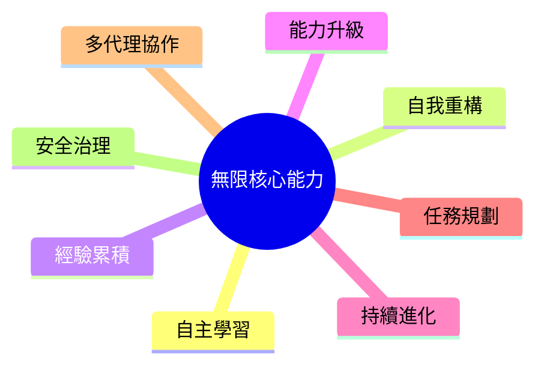

# 🧠 無限核心能力（Infinite Core）

這一層代表 AI Agent 的基礎智能，是所有工具與技能得以發揮效果的底層引擎。

| 能力 | 說明 |
|---|---|
| 🧠 自主學習 | 根據新知識持續調整策略 |
| 🔄 自我重構 | 優化 Prompt、Workflow、程式架構 |
| 📈 經驗累積 | 保存成功案例與失敗經驗 |
| ⚡ 能力升級 | 安裝新 Skill 與工具 |
| ♾ 持續進化 | 根據 Feedback 改善結果 |
| 🎯 任務規劃 | 自動拆解大型任務 |
| 🤝 多代理協作 | 多個 Agent 分工合作 |
| 🛡 安全治理 | 權限控制、稽核與回滾 |

## 設計備註

- **自主學習** 與 **持續進化** 是一對雙循環：前者處理單次任務內的策略調整，後者處理跨任務、跨 session 的長期改善（對應 [`EVOLUTION.md`](EVOLUTION.md) 的 L7 Self-Evolution）。
- **安全治理** 不是附加項，而是貫穿所有其他七項能力的橫向約束層 — 任何自我重構或能力升級都應先過權限與稽核關卡。
- **多代理協作** 是本核心層與 [`MODES.md`](MODES.md) 四種變身模式銜接的關鍵：協作規模越大，越傾向切換到 Heavy Armor Mode。

[← 返回 README](../README.md)
