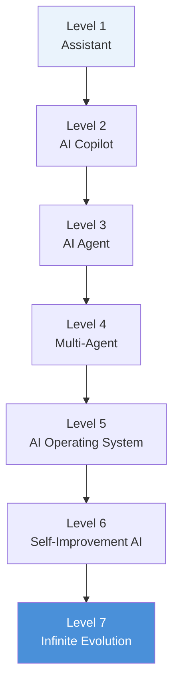

# ♾ 進化等級與 CSE Meta Framework

## 七級進化階梯

| 等級 | 名稱 | 關鍵轉變 |
|---|---|---|
| 1 | Assistant | 被動回應單次問答 |
| 2 | AI Copilot | 主動建議，仍需人類主導決策 |
| 3 | AI Agent | 具備自主任務執行能力 |
| 4 | Multi-Agent | 多個 Agent 分工協作完成複合任務 |
| 5 | AI Operating System | 統一調度工具、技能、工作流程的作業系統層 |
| 6 | Self-Improvement AI | 具備自我評估與能力升級機制 |
| 7 | Infinite Evolution | 持續、開放式的能力擴張，無明確上限 |

---

## CSE Meta Framework 七層對應

若將本文件全部架構收斂進 CSE Meta Framework，可重新定義為：

| 層級 | 模組 | 代表能力 | 對應文件 |
|---|---|---|---|
| L1 | Core Intelligence | 推理、規劃、記憶、自我反思 | [`CORE.md`](CORE.md) |
| L2 | Skills | Prompt、Coding、Data、Business | [`SKILLS.md`](SKILLS.md) |
| L3 | Tools | GitHub、Docker、Playwright、Obsidian、Vercel 等 | [`MODULES.md`](MODULES.md) |
| L4 | Connectors | MCP、CLI、API、Webhook、資料庫 | [`MODULES.md`](MODULES.md) §1–2 |
| L5 | Workflow | 任務拆解、自動化、Multi-Agent 協作 | [`MODES.md`](MODES.md) |
| L6 | Governance | 權限、審計、安全、版本控制 | [`CORE.md`](CORE.md) §安全治理 |
| L7 | Self-Evolution | 學習、優化、評估、能力升級 | 本文件 §進化階梯 |

**閱讀順序建議**：由下而上（L1→L7）代表「這個系統是怎麼被建構出來的」；由上而下（L7→L1）則代表「一個具體任務進來時，系統如何逐層調度資源」。兩種閱讀方向都成立，端看你是在做架構設計還是任務除錯。

---

[← 返回 README](../README.md)
