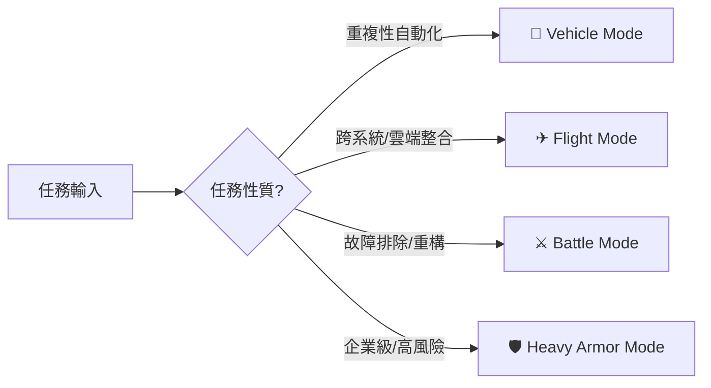

# 🔀 四種變身模式（Transformation Modes）

依任務性質切換的四種營運型態，決定當下該調用哪一組核心能力、工具與技能。

| 模式 | 圖示 | 適合場景 |
|---|---|---|
| **Vehicle Mode** | 🚗 | 自動執行、Workflow、Automation |
| **Flight Mode** | ✈ | 雲端部署、API、多 Agent |
| **Battle Mode** | ⚔ | Bug 修復、Debug、系統重構 |
| **Heavy Armor Mode** | 🛡 | 大型企業、高安全、多人協作、高可用性 |

## 模式選擇準則

- **Vehicle Mode**：任務可被明確拆解為固定步驟時優先選用，對應 [`MODULES.md`](MODULES.md) 的自動化套件（n8n、Zapier、Playwright）。
- **Flight Mode**：涉及多個外部服務或多 Agent 協作時啟用，依賴 Cloud 套件與 AI Agent 套件的 Multi-Agent 能力。
- **Battle Mode**：聚焦單點問題的快速排除，通常是短週期、高專注度的任務，優先調用開發套件。
- **Heavy Armor Mode**：一旦涉及多人協作或企業級高可用性需求，安全治理（見 [`CORE.md`](CORE.md)）與 Governance（見 [`EVOLUTION.md`](EVOLUTION.md) L6）必須全程啟動。

四種模式並非互斥，一個複雜專案的生命週期中可能依序或交錯經歷多個模式。

---

[← 返回 README](../README.md)
