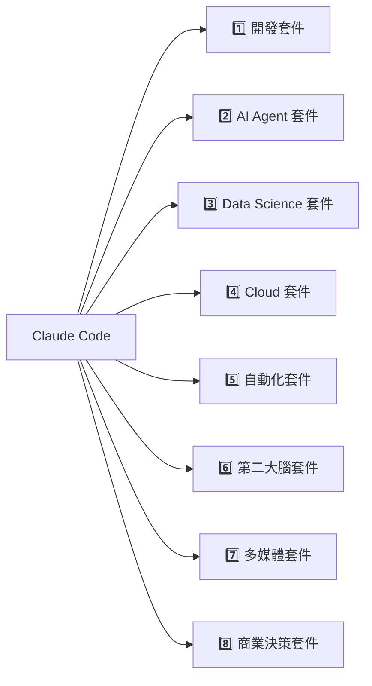

# 🛠 專業配件（Professional Modules）

八大工具套件，是 Claude Code 對外連接真實世界系統的「可插拔配件」。

## 1. 開發套件
`GitHub · Terminal · Docker · Vercel · Playwright · Git · VS Code · MCP`

**能力**：程式開發、Debug、Pull Request、自動部署、自動測試、CI/CD

## 2. AI Agent 套件
`Prompt Engine · Memory · Knowledge · Reasoning · Planning · Reflection · Evaluation · Loop`

**能力**：長期記憶、Context Engineering、多步推理、自我反思、自我修正

## 3. Data Science 套件
`Excel · SQL · Postgres · Pandas · Jupyter · Power BI · Tableau`

**能力**：KPI、Dashboard、Data Analysis、Forecast

## 4. Cloud 套件
`AWS · Azure · GCP · Supabase · Firebase`

**能力**：雲端部署、Serverless、Storage、Database

## 5. 自動化套件
`n8n · Make · Zapier · Playwright · Chrome`

**能力**：Browser Automation、Workflow、Agent Flow、API 串接

## 6. 第二大腦套件
`Obsidian · Notion · GitHub Wiki · Markdown · Vector DB`

**能力**：知識管理、文件管理、AI 記憶

> 💡 此套件是與你既有 **IPPOO 框架**（llm-wiki / Obsidian Vault 作為外部記憶層）直接對應的模組。

## 7. 多媒體套件
`Canva · Figma · Midjourney · Image Generation · Video Generation`

**能力**：海報、UI、Logo、影片、圖像生成

## 8. 商業決策套件
`McKinsey · ROI · KPI · OKR · SWOT · Business Canvas`

**能力**：商業分析、策略規劃、顧問簡報

---

[← 返回 README](../README.md)
