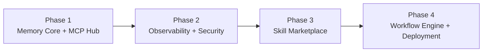

# 🚀 建議擴充模組（Roadmap）

若以「無敵變形金剛」為品牌形象持續擴充，以下模組可補齊系統的可觀測性、記憶與治理能力。

| 模組 | 定位 | 說明 |
|---|---|---|
| 🧩 **MCP Hub** | 連接層 | 統一管理各種工具與服務連接 |
| 🧠 **Memory Core** | 記憶層 | 長期記憶、知識圖譜、RAG 與向量資料庫 |
| 🛠 **Skill Marketplace** | 技能層 | 可安裝、更新、停用各種技能 |
| 📊 **Observability Panel** | 治理層 | 任務追蹤、成本、Token、效能監控 |
| 🛡 **Security Shield** | 治理層 | 權限管理、Secrets、稽核日誌與風險控管 |
| ⚙ **Workflow Engine** | 執行層 | 支援多 Agent 編排與條件式工作流程 |
| 🚀 **Deployment Module** | 執行層 | 一鍵部署到 GitHub、Vercel、Docker 或雲端平台 |

## 優先順序建議

- **Phase 1（記憶與連接優先）**：沒有穩定的記憶層與連接層，其餘模組都只是單次任務工具，無法累積成「作業系統」。這一階段直接對應你正在推進的 IPPOO 框架。
- **Phase 2（治理跟上）**：一旦記憶跨 session 累積，權限與成本失控的風險同步上升，Observability 與 Security 必須在規模化前補齊。
- **Phase 3（技能可插拔化）**：把技能從「寫死在 Prompt 裡」變成「可安裝/停用的模組」，才能支撐多套教學教案或多個事業體並行使用同一套系統。
- **Phase 4（自動部署收尾）**：等前三階段穩定，再把整條流程收斂成一鍵部署，降低每次落地新專案的邊際成本。

---

[← 返回 README](../README.md)
