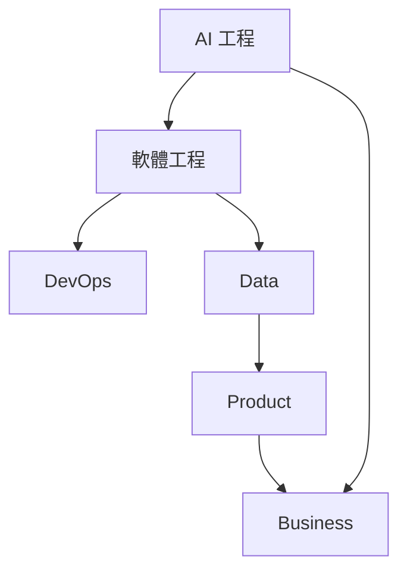

# 🎯 無敵技能樹（Ultimate Skills）

六大技能領域，代表 Claude Code 在不同專業維度上可被評估與升級的技能點。

## AI 工程
Prompt Engineering · Context Engineering · Agent Engineering · Workflow Engineering · MCP · Tool Calling · RAG · Memory · Multi-Agent

## 軟體工程
Full Stack · API · Python · JavaScript · TypeScript · SQL · Docker · Kubernetes

## DevOps
CI/CD · GitHub Actions · Monitoring · Logging · Security · Deployment

## Data
ETL · Dashboard · Visualization · Machine Learning · AI Analytics

## Product
UI/UX · Prototype · User Story · PRD · Roadmap

## Business
AI Strategy · Consulting · SOP · KPI · ROI

---

## 技能樹依賴關係（簡化示意）

**解讀**：AI 工程是地基，軟體工程把它落地成可執行系統；DevOps 確保穩定上線，Data 提供決策依據；Product 把數據轉譯為使用者價值，最終在 Business 層收斂成策略與 ROI —— 這條路徑也正是「AI 課綱」或「顧問簡報」的敘事骨架。

---

[← 返回 README](../README.md)
